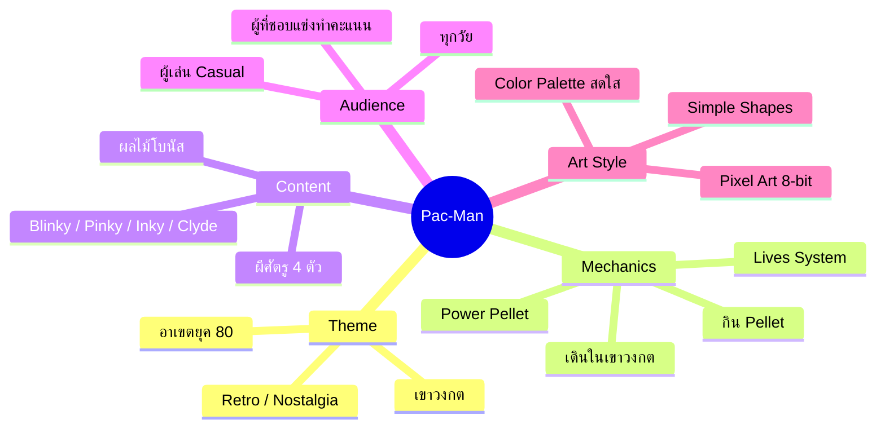
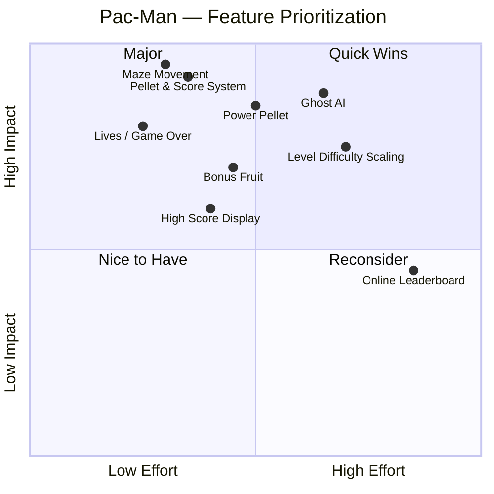
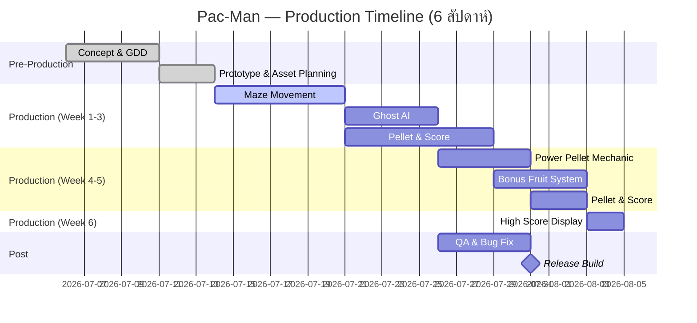

---
### MVP (Minimum Viable Product) — ทำให้เสร็จใน 6 สัปดาห์:

**Quadrant 1 (Quick Wins)**: ทำ ASAP
- ✅ Maze Movement
- ✅ Pellet & Score System
- ✅ Lives / Game Over
- ✅ High Score Display

**Quadrant 2 (Major Features)**: Core of the game
- ✅ Ghost AI (Basic ก่อน)
- ✅ Power Pellet
- 🔄 Bonus Fruit (ถ้ามีเวลา)

**Quadrant 3 (Nice to Have)**: ตัดหรือทำทีหลัง
- ❌ Level Difficulty Scaling (ยาก + ประโยชน์น้อย)
- ❌ Advanced Ghost AI (ไว้ Post-Launch)

**Quadrant 4**: ไม่มีตัวอย่างที่เหมาะสม (ไม่ควรเอามา)
- ❌ Online Leaderboard (Effort สูง Impact ต่ำ)

**สรุป MVP Scope**:
- **ต้องทำ**: Quadrant 1 + Quadrant 2 ทั้งหมด (7 features)
- **ถ้ามีเวลา**:Level Scaling
- **ตัดออก**: Online Leaderboard, Advanced AI
---

---
### Timeline Breakdown:

**Week 1 (Jul 6–12)**: Pre-Production & Foundation
- Concept, GDD, Prototype → Maze Movement (foundation)

**Week 2 (Jul 13–19)**: Core Mechanics
- Pellet System, Ghost AI (คู่ขนาน)

**Week 3 (Jul 20–26)**: Power-up & Bonus
- Power Pellet, Bonus Fruit

**Week 4 (Jul 27–Aug 2)**: Polish
- Lives System, Score Display

**Week 5-6 (Aug 3–15)**: QA & Release
- Alpha → Bug Fix → Final QA → Gold Master 

**Milestone**:
- **Alpha Build** (end of Week 4): ทั้ง MVP feature พร้อม
- **Gold Master** (end of Week 6): เกมพร้อมปล่อย
---
